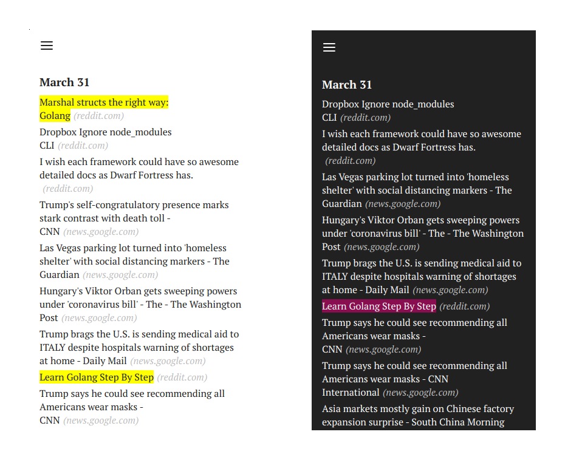

# headline

Ascetic RSS reader in JavaScript, no server required, you are fully in control of your reader. Very predictable, fast and small - about 4KB in size when minified. Ah, it's also a PWA so it even works offline.

The story behind Headline and its origins is told [here](https://zserge.com/posts/rss/).

How to use it? Just fork it and use it from Github Pages. Or simply copy all static files and open them locally.

Feel free to fork or customize! If you found an issue - please make a PR.
